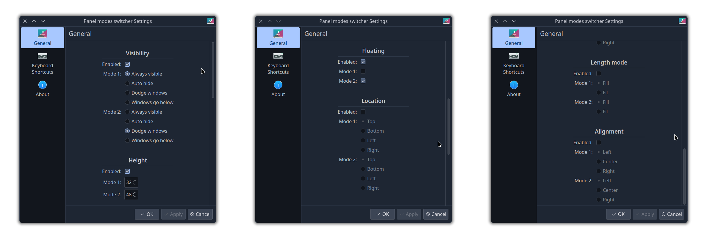

# Panel Modes Switcher plasmoid

Switch between two KDE Plasma panel profiles on the fly

## Demo

https://github.com/luisbocanegra/plasma-panel-modes-switcher/assets/15076387/ee9fa2c4-867d-4cf8-abc5-86bcfaa90031

<details>
    <summary>Settings</summary>



</details>

## Requirements

* Plasma 6

## Current & planned features

* [x] Switch between two panel profiles
  * [x] Visibility
  * [x] Height
  * [x] Floating
  * [x] Location
  * [x] Length mode
  * [x] Alignment
  * [ ] Opacity
* [ ] Backup panel settings in case we break them???

## Installing

* Install from KDE Store or use `Get new widgets..`
  * ~~Plasma 5 version~~ maybe?
  * [Plasma 6 version](https://store.kde.org/p/2130222)

### Manual install

1. Install these dependencies (please let me know if I missed or added something unnecessary)

    ```txt
    cmake extra-cmake-modules libplasma
    ```

2. Run `./install.sh`

## Resources

* [Plasma Desktop Scripting](https://develop.kde.org/docs/plasma/scripting/api/)
* [Plasma Widget Properties](https://develop.kde.org/docs/plasma/widget/properties/)
* [plasma-workspace/shell/scripting/panel.cpp](https://invent.kde.org/plasma/plasma-workspace/-/blob/master/shell/scripting/panel.cpp)

## Acknowledgement

* [Google LLC. / Pictogrammers](https://pictogrammers.com/library/mdi/) for the panel icons
